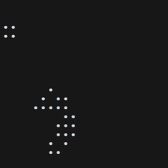

# Conway's Game of Life

A Rust implementation of Conway's Game of Life with a CLI interface.



## Building

```bash
cargo build --release
```

## Running

The CLI supports the following options:

```
USAGE:
    life [OPTIONS]

OPTIONS:
    -w, --width <width>         Grid width [default: 10]
    -H, --height <height>      Grid height [default: 10]
    -c, --cells <cells>         Initial live cells in format "x1,y1;x2,y2;..." [default: ""]
    -m, --mode <mode>          Output mode: ascii or unicode [default: ascii]
    -g, --generations <gens>    Number of generations to run [default: 1]
    -d, --delay <delay>         Delay between generations in milliseconds [default: 100]
    -h, --help                  Print help information
    -V, --version               Print version information
```

### Examples

Run with default settings (10x10 grid):
```bash
cargo run --release
```

Run with custom grid size:
```bash
cargo run --release -- -w 20 -H 10
```

Add initial live cells:
```bash
cargo run --release -- -c "1,1;2,2;3,3"
```

Run multiple generations with unicode output:
```bash
cargo run --release -- -g 5 -m unicode
```

## Library

The core game logic is in `game_of_life_lib/` and can be used as a library.

```rust
use game_of_life_lib::{GameState, Generation, Point};
use std::collections::HashSet;

let initial_cells: HashSet<Point> = vec![
    Point::new(1, 1),
    Point::new(2, 2),
    Point::new(0, 0),
].into_iter().collect();

let generation = Generation::new(initial_cells, 10, 10);
let mut state = GameState::new(generation);

// Iterate through generations
for gen in state {
    println!("Live cells: {:?}", gen.live_cells);
}
```

## Rules

1. Any live cell with fewer than two live neighbors dies (underpopulation)
2. Any live cell with two or three live neighbors lives on
3. Any live cell with more than three live neighbors dies (overpopulation)
4. Any dead cell with exactly three live neighbors becomes alive (reproduction)
